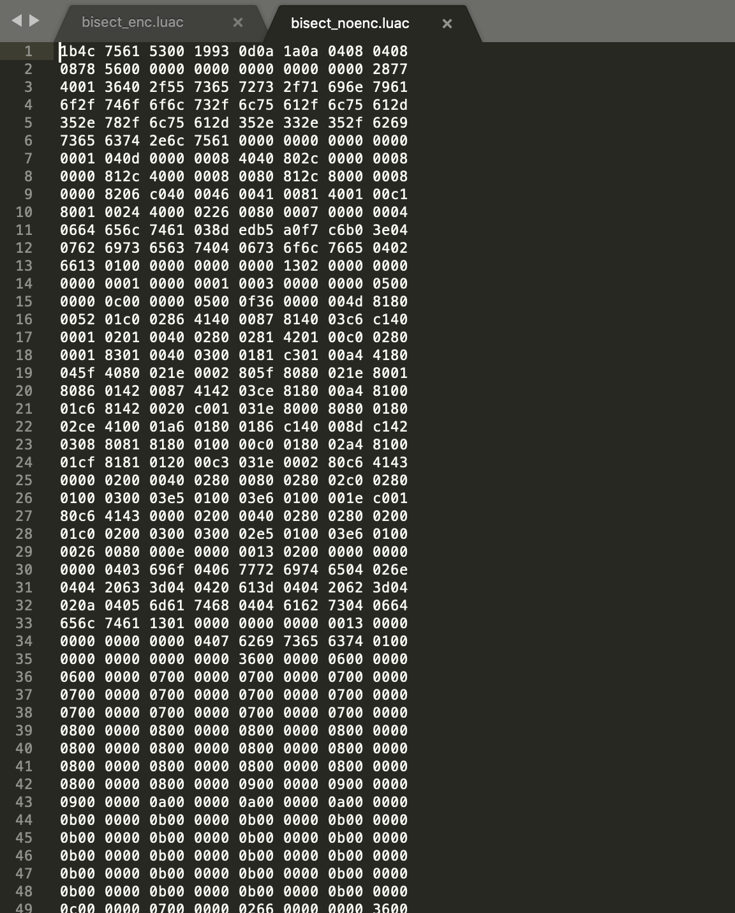
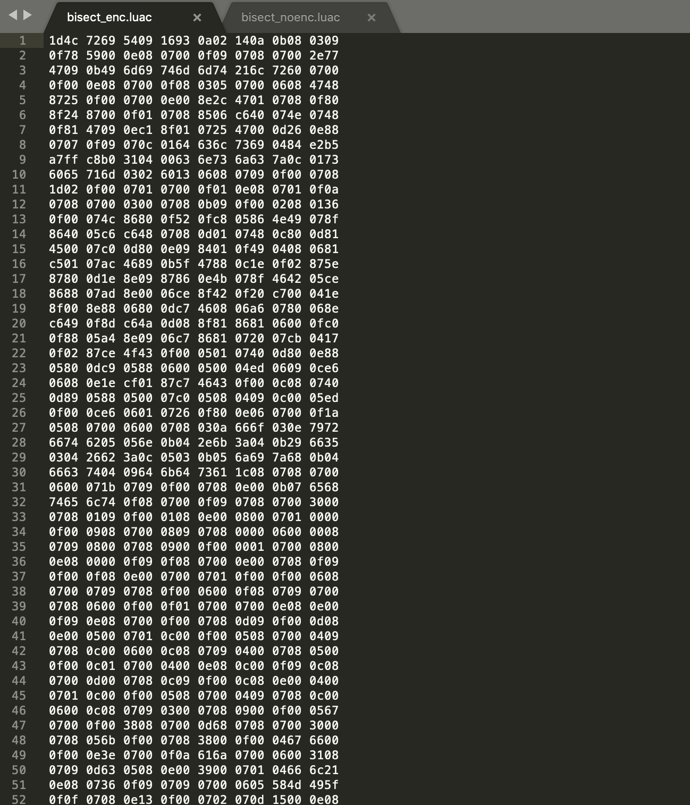
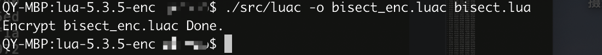
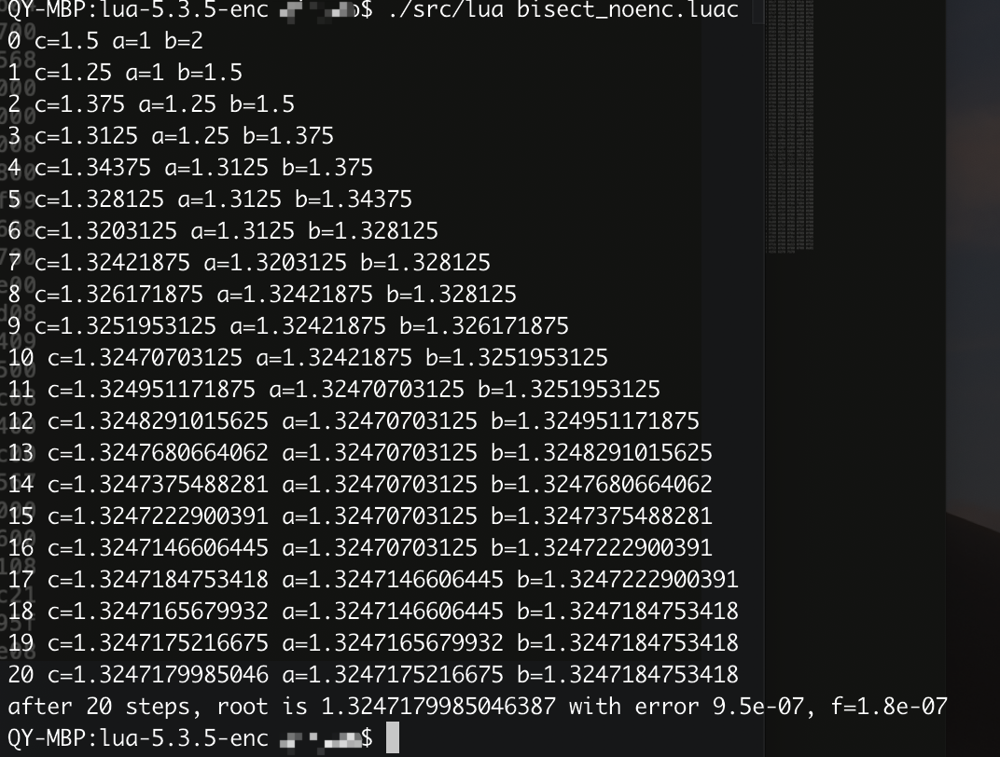
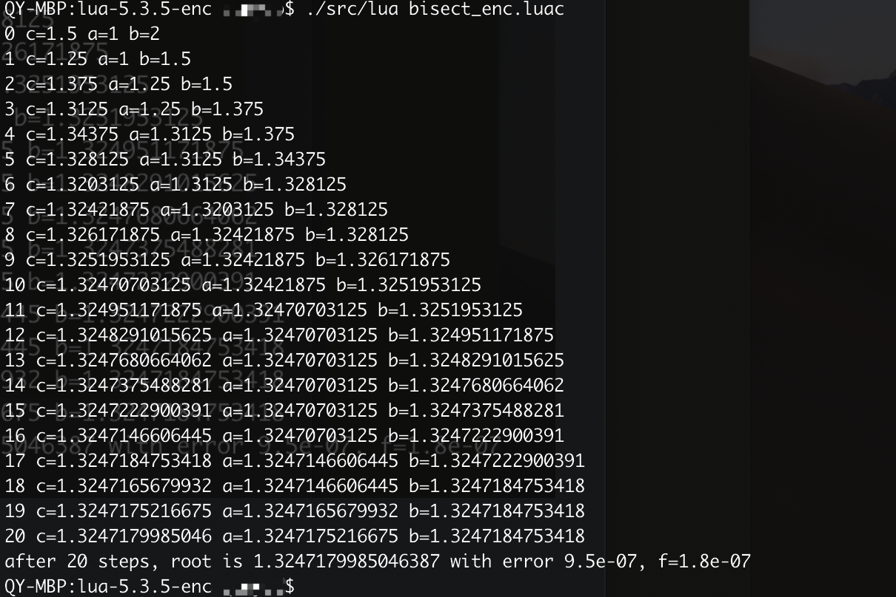

# Demo

###  support version 5.0 + ，I'm not yet test 5.0 -, should support.

## origin hex data

## encrypt hex data

## generate luac

## run luac

# Business cooperation, please contact

Me : 13018266036@163.com

Company：https://www.kiwisec.com/

